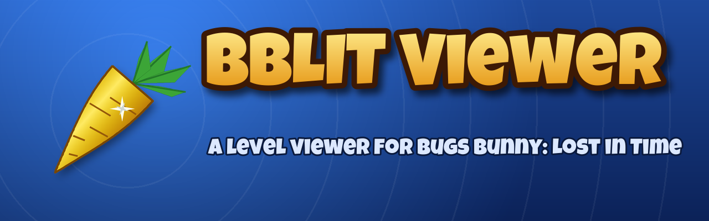
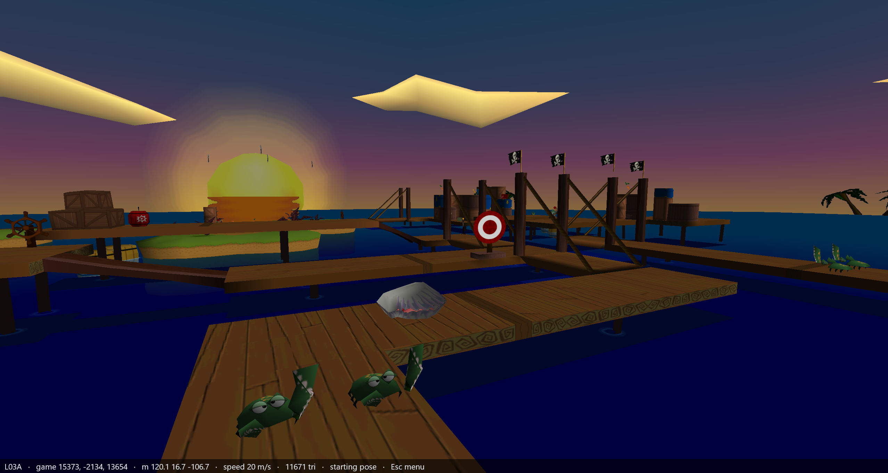
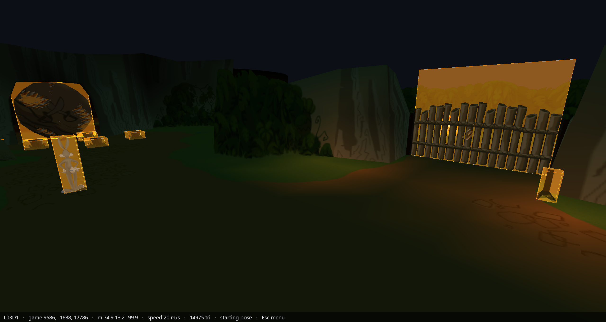
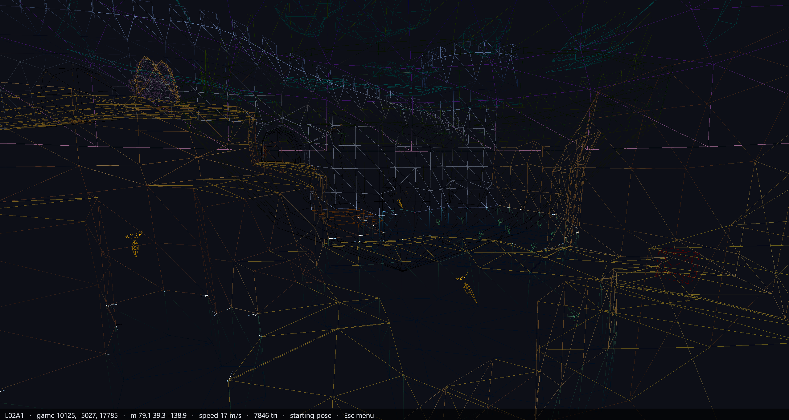

<p align="center"></p>

<p align="center">Un viewer dei livelli di <i>Bugs Bunny: Lost in Time</i> (PC, 1999).</p>

<p align="center"><b><a href="../../releases/latest">Scarica l'ultima release</a></b> · <a href="README.md">README</a></p>

<p align="center"></p>

## Requisiti

- Windows 10 o 11 a 64 bit;
- una scheda video con driver OpenGL 3.3 (qualunque scheda degli ultimi dieci
  anni, con il suo driver installato);
- i file dei livelli della tua copia del gioco, versione PC (sotto).

Niente da installare: estrai la release dove vuoi e avvia `BBLIT Viewer.exe`
(Python e le librerie stanno dentro `_internal\`). Il programma non è
firmato, quindi Windows può avvisare che l'editore è sconosciuto: "Ulteriori
informazioni" → "Esegui comunque".

## Procurarsi i livelli

**Non è incluso nessun dato del gioco**, né qui né nella release. Il viewer
legge i file dei livelli (`.bze`) della tua copia della **versione PC**: stanno
nella cartella `Datas\bze` del gioco, sul CD o nella cartella di installazione.
La versione PlayStation non è supportata.

- Copia i file `.bze` in `bze_levels\`, accanto al viewer. Tutti o solo
  alcuni: i livelli senza file compaiono in grigio nel menu.
- Oppure lasciali dove sono: **Opzioni generali → Cartella dei livelli**, e
  scegli la cartella del gioco o la sua `Datas\bze`. La scelta viene ricordata.

Senza livelli il viewer si apre su una pagina che spiega tutto questo, con i
pulsanti per aprire `bze_levels\` o scegliere una cartella. I file del gioco
vengono solo letti, mai modificati.

## Cosa fa

- **Il viewer**: tutti i livelli del gioco, era per era, con l'hub (Nowhere),
  l'Era selector e le varianti `_8`. Terreno, oggetti nella posa di partenza,
  animazioni ai 15 tick al secondo del gioco, texture animate, la cupola del
  cielo, le fusioni semitrasparenti e i cloni dei template che le regole del
  livello fanno comparire. Camera libera; menu in inglese e in italiano.
- **Flags** (Opzioni livello → Flags): vedi sotto.
- **Due modi di leggere le coordinate texture del gioco**, perché il gioco
  stesso ne ha due (Opzioni video → Coordinate texture): con una **scheda
  AMD** il gioco taglia la striscia esterna di ogni texture e il viewer può
  fare lo stesso. Vedi [docs/VIEWER_Ita.md](docs/VIEWER_Ita.md).
- **Strumenti da riga di comando** in `tools/`, usabili da soli:
  - `bze.py`: apre e decomprime il contenitore `.bze`;
  - `export_obj.py`: esporta terreno e oggetti di un livello in OBJ + MTL, con
    le texture, per Blender e simili;
  - `tim.py`: esporta le texture TIM in PNG.

## Comandi

| tasto | azione |
|---|---|
| W A S D | muovi la camera |
| Q / E | camera su / giù |
| tasto destro | guarda (tenendolo premuto) |
| rotella | velocità della camera |
| Shift / Ctrl | più veloce / più lento |
| Esc | apri / chiudi il menu |
| ↑ ↓ ← → Invio | nel menu: scegli, cambia, conferma |
| Backspace / M | nel menu: indietro |
| [ ] | livello precedente / successivo |
| R | camera al punto di partenza |
| T / O / H / M / F | texture / oggetti / cielo / fusioni / wireframe |
| N / G | texture animate / cloni dei template |
| P | ferma / riavvia le animazioni |
| - / + | tick al secondo |
| L | filtro bilineare |
| Alt+Invio | schermo intero |

Dai sorgenti, `python bblit/viewer.py L03A` apre direttamente un livello;
`python bblit/viewer.py --help` elenca le opzioni (inquadratura con `--camera`,
un PNG con `--screenshot`, animazioni ferme con `--tick`, le sovrapposizioni,
la lingua...). La guida completa è in [docs/VIEWER_Ita.md](docs/VIEWER_Ita.md).

## Le flag

Sovrapposizioni disegnate sopra la scena, tutte spente a ogni avvio. Alcune sono
**lette** direttamente dai dati del livello; altre sono **dedotte** combinando
quello che dicono i dati con quello che si vede: indicano dove cercare, non
sono una prova.

| flag | cosa mostra | come è fatta |
|---|---|---|
| Hard walls | i muri `0x7F` della heightmap: fermano a qualunque altezza | letta |
| Ground | il terreno su cui si sta davvero (la heightmap) | letta |
| Collision boxes | il box di collisione di ogni oggetto, come lo prova il gioco: SOLID, PLATFORM (ci si sta sopra) o solo TOUCH | letta |
| Death and damage zones | le zone che uccidono (respawn al checkpoint) o feriscono, ruotate come le ruota il gioco, col nome DEATH, DEATH FLOOR o DAMAGE in alto | letta |
| Teleport zones | le zone che mandano qualcuno da qualche parte, con una freccia fino al punto: ENTRANCE (e il livello da cui si arriva), TELEPORT, RECOVER, RESTART, e LEVEL col livello a cui portano | letta |
| Portals | le facce del terreno che il gioco non disegna mai: sono portali, con l'area a cui portano | letta |
| Invisible walls | i muri duri dove non c'è niente di visibile, e i gradini di più di 100 unità | dedotta |
| No collision | le facce che si vedono ma su cui non si sta, e le pareti collegate che si attraversano | dedotta |
| DEATH FLOOR | in Death and damage zones: le zone di morte grandi almeno metà del livello (mare, abisso) | dedotta |
| Area boxes | ogni blocco della heightmap come un box: lati che fermano da dentro, il soffitto del salto in cima | letta nel codice, non verificata nel gioco |

<p align="center">
  
  
</p>

Le scoperte dietro ogni flag sono in
[docs/FORMAT_NOTES_Ita.md](docs/FORMAT_NOTES_Ita.md) (282-288). Nel viewer in
italiano le flag hanno i nomi tradotti.

## Costruire l'eseguibile

Python 3.10 o più recente, su Windows (il viewer usa OpenGL 3.3):

- [pyglet](https://pyglet.org/) — la finestra e OpenGL: basta per avviare
  `python bblit/viewer.py`;
- [Pillow](https://python-pillow.org/) — solo per gli script di `branding/`;
- [PyInstaller](https://pyinstaller.org/) — per l'eseguibile.

```
python -m venv .venv
.venv\Scripts\pip install pyglet pillow pyinstaller
.venv\Scripts\python tools\build_exe.py
.venv\Scripts\python tools\make_release.py
```

`build_exe.py` scrive `BBLIT Viewer.exe` e `_internal\` nella cartella del
progetto; `make_release.py` li mette, con questo README, la licenza, le
licenze di terze parti (`THIRD_PARTY_LICENSES.txt`) e una `bze_levels\` vuota, in `release\BBLIT Viewer\` e in uno zip, e stampa lo SHA-256
dello zip per le note della release (l'eseguibile non è firmato). La release è
portatile: le impostazioni restano in `userdata\` accanto a lei. I pezzi di un
livello finiscono in cache in `extracted\` (circa 2 MB ciascuno), riempita in
sottofondo all'avvio.

## Note sul formato

[docs/FORMAT_NOTES_Ita.md](docs/FORMAT_NOTES_Ita.md) raccoglie ciò che questo
progetto ha trovato sui dati (scoperte 256-288), ognuna con il test che poteva
smentirla. Continuano la numerazione della
[documentazione di reverse engineering di Ombelll](https://github.com/Ombelll/Bugs-bunny-lost-in-time-reverse-engineered),
su cui il viewer è costruito; dove una scoperta la corregge, lo dice.

## Contribuire

Apri una **issue**: un livello che sembra sbagliato, una flag che non
corrisponde al gioco, una lettura del formato. Per tutto ciò che riguarda il
comportamento del gioco aiuta molto una schermata o un breve video del gioco
accanto a quella del viewer. Le pull request non vengono accettate: le
correzioni si fanno qui, a partire dalle issue. Per favore non allegare mai
file del gioco.

## Community

La community di speedrun e TAS di *Bugs Bunny: Lost in Time* è su Discord:
**https://discord.gg/PThM9ucHmu**. Grazie a tutti lì per l'aiuto in questi
anni.

## Crediti

- **Ombelll** — la [documentazione di reverse engineering](https://github.com/Ombelll/Bugs-bunny-lost-in-time-reverse-engineered)
  di contenitore, load script, modelli, animazioni e terreno.
- **quantumdude836** — [BugsDecomp](https://github.com/quantumdude836/BugsDecomp),
  la decompilazione, usata come riferimento.
- **DCxDemo** — il CTR viewer di [CTR-tools](https://github.com/CTR-tools/CTR-tools):
  un programma che uso da anni e che mi ha sempre affascinato. La sua interfaccia
  (menu, opzioni, impostazioni portatili) ha ispirato questa. Grazie.
- Font del logo: [Luckiest Guy](https://fonts.google.com/specimen/Luckiest+Guy)
  di Astigmatic (Apache 2.0). Logo, icona e sfondo sono disegnati dagli script
  in `branding/`.

## Note legali

Progetto amatoriale non ufficiale, non affiliato né approvato da Warner Bros.,
Atari o Behaviour Interactive. *Bugs Bunny*, *Looney Tunes* e tutti i
personaggi collegati sono marchi di Warner Bros. Entertainment Inc. Il
repository e la release non contengono codice né dati del gioco; serve una
propria copia del gioco.

## Licenza

[GPL-3.0](LICENSE).

---

2026, AleMastroianni
